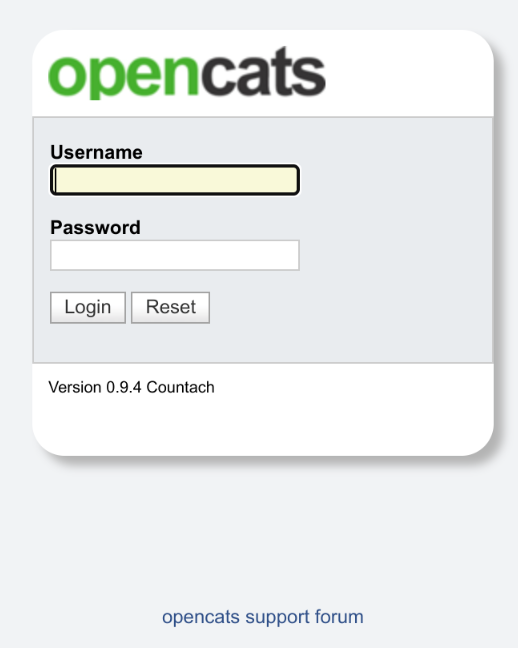

# Run the Installer

### Install the OpenCATS software[¶](broken-reference)

In your browser, go to localhost/opencats (Or use the address of your server or VPS in place of “localhost”).

**Note: Database connectivity**

If you are running OpenCATS locally on your computer, or on some shared hosts, the host address will be localhost. If your server, VPS (some shared hosting too), you will need to enter the specific address to access.

When you  `Test Database Connectivity,` I usually get red the first few tries after click the `test database connectivity` button. If you try more than a couple times and it stays red, you have either entered your db information incorrectly, or you have set your MySQL/MariaDB database up incorrectly. It needs to be corrected before proceeding.

**Note: Setup resume indexing**

* Change the paths to the executables to the correct paths. You will need to find and install these separately. The software will work without them but resume indexing will be unavailable. YOu can always amend this after installation, and set the correct path in config.php. Normally, they should be as follows:
* /usr/bin/antiword
* /usr/bin/pdftotext
* /usr/bin/html2text
* /usr/bin/unrtf

**Note: Mail Settings**

OpenCATS can send emails. If you don’t want to use it, you don’t have to. OpenCATS works great either way! If you're using gmail you will need to use app passwords to generate a unique application password. Opencats uses the project [PHPMailer](https://github.com/PHPMailer/PHPMailer) for email functions.&#x20;

**Note:  Loading extras**

**zip code lookup** is deprecated and replaced in the codebase with a google address lookup. You will need to set this up later, and provide an API key (thank you, google!)\
**\[ADD]**

Note

The default username and password for your new install is : admin/admin (all lowercase)

Click `Start OpenCATS` for your login screen.

If you are exposing your OpenCATS to the web (i.e. enabling the job portal) then remember to deploy .[htaccess security configuration.](../technical-configuration-options/vital-security-restrict-access-to-upload-folders-.htaccess.md) &#x20;
